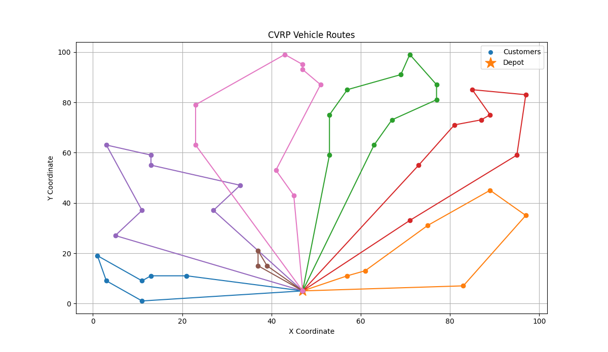
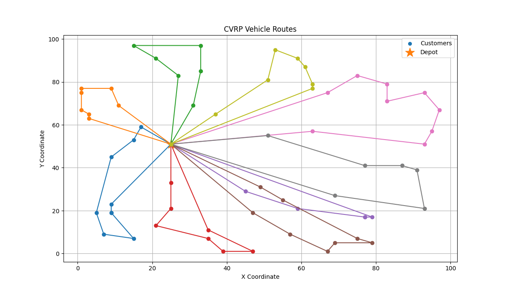
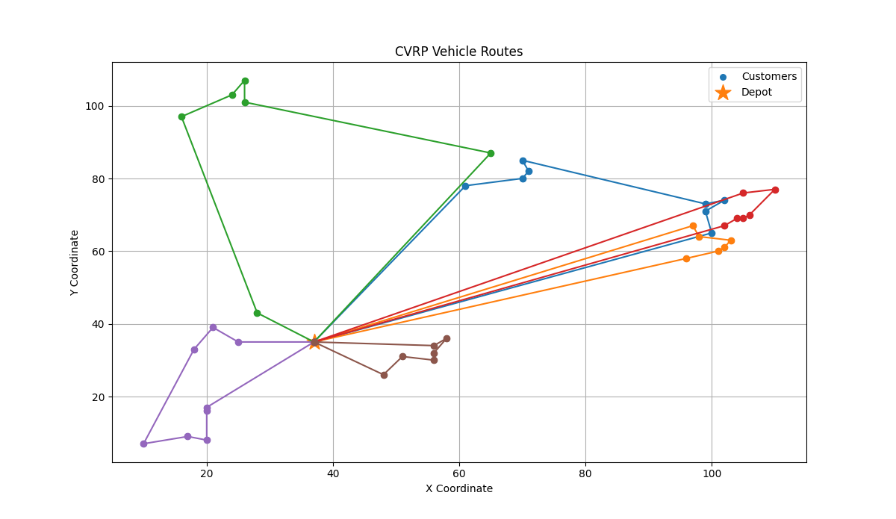
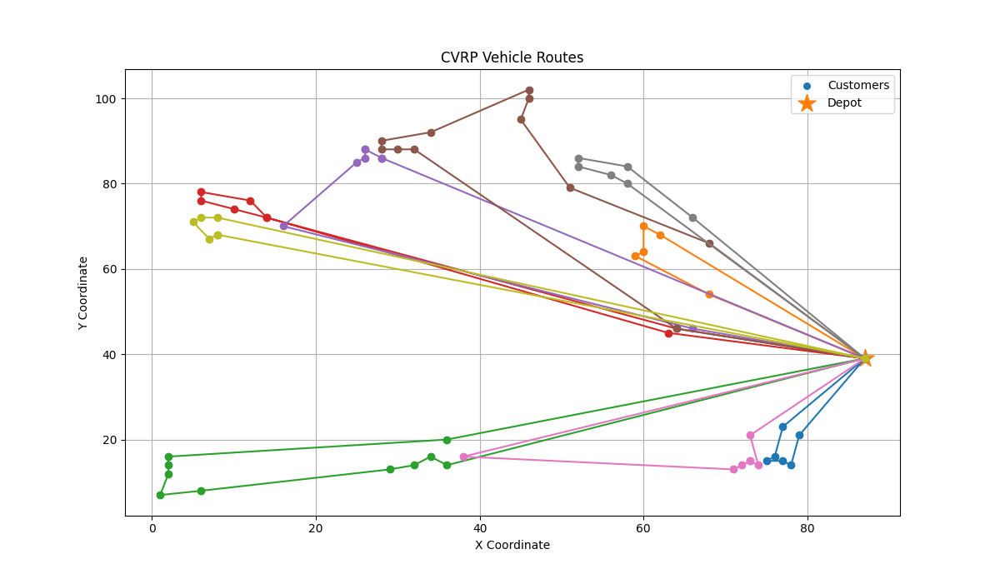
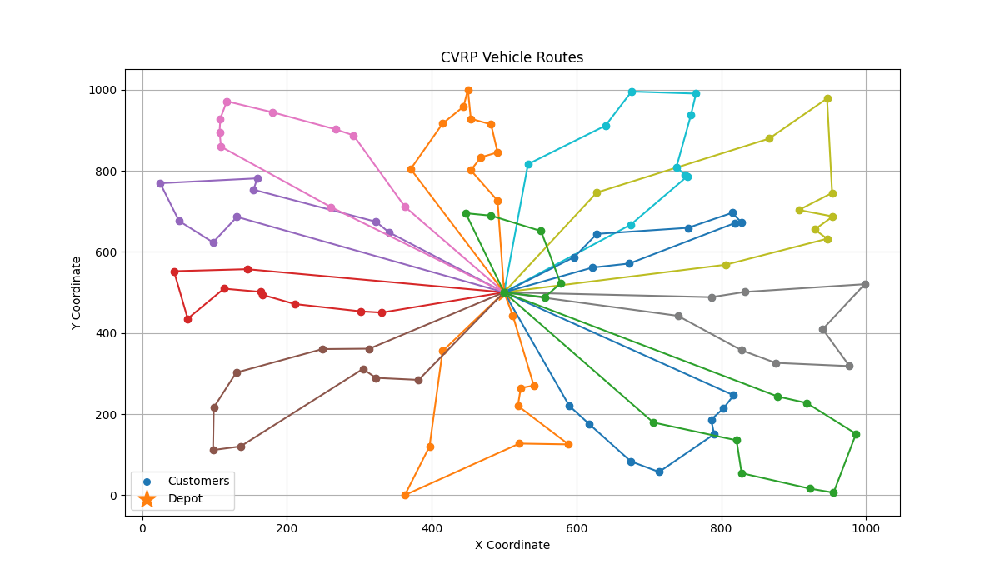
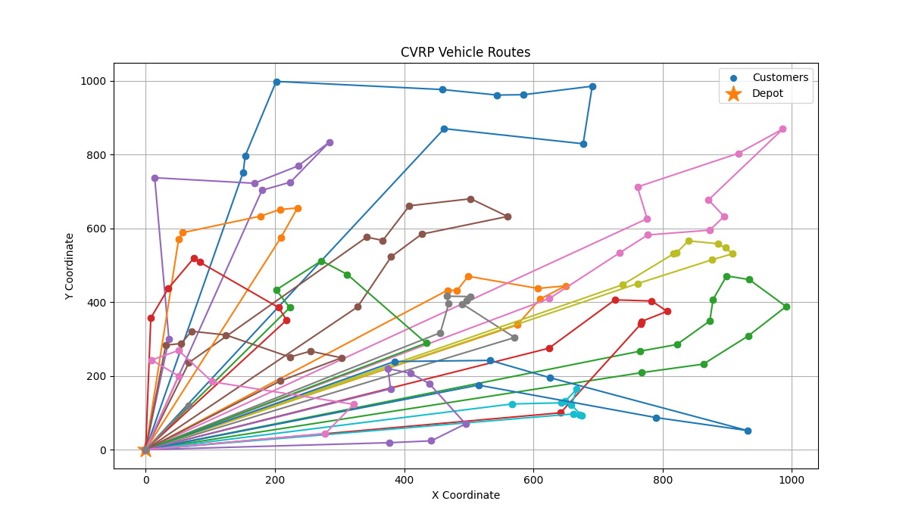

# Capacitated Vehicle Routing Problems solved with Google OR-Tools
        
The Capacitated Vehicle Routing Problem (CVRP) is a classical NP-hard combinatorial optimization problem that seeks to minimize total routing cost while satisfying customer demands without exceeding vehicle-capacity constraints. As exact optimization becomes computationally intractable for larger instances, heuristic and metaheuristic methods are commonly used to obtain high-quality solutions efficiently. 
     
**Objective:** This project models and evaluates the performance of Google OR-Tools for solving CVRPs using benchmark instances from CVRPLIB of varying sizes and structural characteristics. Specifically, it investigates how first-solution strategies, local-search metaheuristics, and runtime limits affect solution quality under computational budgets, with performance measured against the best-known solutions (BKS) published by CVRPLIB.
           
## Dataset

Benchmark instances are obtained from **CVRPLIB**.

Six instances from the A, B, and X sets are evaluated:

| Instance | # Customers | # Vehicles | Single Vehicle Capacity | Total Fleet Capacity | Total Demand | Unused Capacity | 
|---|---:|---:|---:|---:|---:|---|
| A-n48-k7 | 47 | 7 | 100 | 700 | 626 | 74 |
| A-n65-k9 | 64 | 9 | 100 | 900 | 877 | 23 |
| B-n41-k6 | 40 | 6 | 100 | 600 | 567 | 33 |
| B-n68-k9 | 67 | 9 | 100 | 900 | 837 | 63 |
| X-n110-k13 | 109 | 13 | 66 | 858 | 816 | 42 |
| X-n129-k18 | 128 | 18 | 39 | 702 | 665 | 37 |

- **Set A — Augerat instances:** Customer demands and locations are generated randomly.
- **Set B — Augerat instances:** The layout consists of specific "clusters" of nodes. This arrangement tests an algorithm's ability to navigate tight local groupings while managing overall vehicle payloads and route limits.
- **Set X — Uchoa et al. instances:** a much newer and substantially broader benchmark set, ranging from roughly 100 to 1,000 customers. Unlike A and B, X was deliberately designed to provide high diversity in instance characteristics, including different customer-location patterns, demand distributions, depot locations, and route lengths. These instances are more challenging and representative of modern CVRP benchmark.

               
## Problem Description

The Capacitated Vehicle Routing Problem determines a set of vehicle routes that serve all customers while minimizing total travel distance.

The model requires that:

- Each customer is visited exactly once.
- Each route starts and ends at the depot.
- The total demand assigned to a vehicle does not exceed its capacity.
- Total travel distance across all vehicle routes is minimized.
           
## Mathematical Formulation

Let:

- $V = \{0,1,\ldots,n\}$ be the set of nodes, where node $0$ represents the depot.
- $C = V \setminus \lbrace 0 \rbrace$ is the set of customers. 
- $K = \{1,\ldots,m\}$ be the set of vehicles.
- $c_{ij}$ be the travel distance from node $i$ to node $j$.
- $q_i$ be the demand of customer $i$.
- $Q$ be the capacity of each vehicle.

Define the binary decision variable:

$$
x_{ijk} =
\begin{cases}
1, & \text{if vehicle } k \text{ travels directly from node } i \text{ to node } j,\\
0, & \text{otherwise,}
\end{cases}
\qquad
\forall i,j \in V\; i \neq j\; k \in K
$$
                 
#### Objective Function:

The objective is to minimize the total distance traveled across all vehicle routes:

$$
\min \sum_{k \in K}
\sum_{i \in V}
\sum_{\substack{j \in V \\ , j \neq i}} 
c_{ij}x_{ijk}
$$

#### Customer Coverage:

Each customer must be visited exactly once by one vehicle:

$$
\sum_{k \in K}
\sum_{\substack{j \in V \\,  j \neq i}} 
x_{ijk} = 1
\qquad \forall i \in C
$$

#### Vehicle Capacity:

The total demand assigned to each vehicle cannot exceed its capacity:

$$
\sum_{i \in C}
q_i
\sum_{\substack{j \in V \\ , j \neq i}} 
x_{ijk}
\leq Q
\qquad \forall k \in K
$$

#### Flow Conservation:

For each vehicle, entering a customer node requires leaving that node:

$$
\sum_{\substack{j \in V \\ j \neq i}} x_{ijk} = \sum_{\substack{j \in V \\ j \neq i}} x_{jik} \qquad \forall i \in C,\; k \in K
$$ 

#### Depot Constraints:

Each used vehicle departs from and returns to the depot at most once:

$$
\sum_{j \in C} x_{0jk} \leq 1
\qquad \forall k \in K
$$

$$
\sum_{i \in C} x_{i0k} \leq 1
\qquad \forall k \in K
$$
              
**Note:** This formulation summarizes the primary CVRP objective and constraints represented by the OR-Tools routing model. Route continuity and connectivity are handled internally by `RoutingModel` rather than through an explicitly implemented arc-based MIP formulation. 
               
## Implementation and Structure

The implementation includes:

- `RoutingIndexManager` for mapping between routing and problem indices
- `RoutingModel` for constructing the routing problem
- A distance callback for arc costs
- A demand callback for customer demands
- A capacity dimension for enforcing vehicle capacity constraints
- Configurable first-solution and local-search strategies
- Solution validation for total demand and route feasibility

```text
CVRP_solved_by_ORtools.py
│
├── Load CVRPLIB instance
│
├── Create data model
│
├── Build routing model
│   ├── RoutingIndexManager
│   ├── Distance callback
│   └── Demand / capacity constraints
│
├── Configure search
│   ├── First-solution strategy
│   ├── Local-search metaheuristic
│   └── Time limit = 60
│
├── Solve
│
└── Process results
    ├── Print solution
    ├── Route visualization
    └── Calculate BKS gap
```

                          
## Algorithms

Each CVRP instance is evaluated in two stages: a first-solution construction heuristic generates an initial feasible solution, followed by a local-search metaheuristic that improves the solution.
                   
Although Google OR-Tools provides a broad range of first-solution strategies, this study focuses on four representative and competitive construction heuristics selected to capture distinct route-construction approaches: greedy path construction, parallel and sequential insertion, and savings-based route construction:
      
- `PATH_CHEAPEST_ARC`: Start from a route "start" node, constructs routes sequentially by repeatedly extending the current route through the cheapest feasible arc. It represents a greedy, path-based construction approach.
     
- `PARALLEL_CHEAPEST_INSERTION`: Builds multiple routes simultaneously by repeatedly selecting low-cost feasible customer insertions across the developing routes. It represents a parallel insertion-based approach.
    
- `LOCAL_CHEAPEST_INSERTION`: Considers customers sequentially and inserts each customer into its cheapest feasible position among the existing routes. It provides a sequential insertion-based alternative to Parallel Cheapest Insertion.
         
- `SAVINGS`: A savings-based construction approach inspired by the Clarke-Wright Savings algorithm. Routes are formed by prioritizing combinations that reduce travel cost relative to serving customers separately from the depot.
   
Three local-search metaheuristics are then evaluated for improving the constructed solutions:
          
- `GUIDED_LOCAL_SEARCH`: Escapes local optima by dynamically penalizing costly solution features, encouraging the search to explore alternative regions of the solution space.
            
- `TABU_SEARCH`: Uses short-term search memory to temporarily restrict recently used moves, reducing cycling and encouraging exploration beyond the current local optimum.
                   
- `SIMULATED_ANNEALING`: Probabilistically accepts some worsening moves, particularly earlier in the search, to escape local optima and explore alternative solutions.
           
Preliminary experimentation indicated that these strategies performed competitively across the selected CVRPLIB instances. Other strategies were explored during initial testing but were excluded from the final benchmark to keep the analysis manageable, as they offered limited additional methodological diversity, were less consistently competitive, or were less relevant to the scope of the study.
                                
## Results

### Metaheuristic Comparison:
                
The initial evaluation considered all combinations of the four selected first-solution construction heuristics and three local-search metaheuristics:                    
                
4 construction heuristics × 3 local-search metaheuristics = 12 configurations
                          
Across the initial comparisons, `Guided Local Search` demonstrated the most consistent performance across the tested instances, suggesting greater robustness than `Tabu Search` and `Simulated Annealing` under the experimental settings. As a representative example, the table below presents the local-search comparison for A-n48-k7. Similar comparisons were conducted across all benchmark instances, with `Guided Local Search` consistently producing the strongest results.
                                
| A-n48-k7 | `Guided Local Search` | `Tabu Local Search` | `Simulated Annealing` |
|---|---:|---:|---|
| `Parallel Cheapest Insertion` | **1088** | 1116 | 1152 | 
| `Path Cheapest Arc` | **1073** | 1102 | 1221 |
| `Savings` | **1073** | 1097 | 1097 | 
| `Local Cheapest Insertion` | **1084** | 1127 | 1192 |
                           
For this instance, `Guided Local Search` produced lower final route distances under all four first-solution strategies, indicating that its advantage was not dependent on a single initialization method. Similar comparisons across the remaining benchmark instances showed the same overall pattern. Based on this consistency, `Guided Local Search` was selected as the local-search metaheuristic for the subsequent comparison:
                
4 construction heuristics × 1 local-search metaheuristic (GLS) = 4 configurations per instance
                        
This allowed the four construction heuristics to be evaluated across a broader range of CVRPLIB instances without testing less competitive metaheuristic configurations.
               
### First-Solution Construction Heuristics Comparison:
              
With the local-search metaheuristic fixed to `Guided Local Search`, the four selected first-solution construction heuristics were evaluated across all benchmark instances. In contrast to the consistent performance of GLS in the metaheuristic comparison, no single construction heuristic consistently outperformed the others. The best solution(s) for each instance are highlighted in bold.
     
| Instances | A-n48-k7 | A-n65-k9 | B-n41-k6 | B-n68-k9 | X-n110-k13 | X-n129-k18 |
|---|---:|---:|---:|---:|---:|---|
| `Parallel Cheapest Insertion` | 1088 | **1184** | 843 | 1290 | 15449 | **30217** | 
| `Path Cheapest Arc` | **1073** | 1218 | **829** | **1289** | 15260 | 30506 | 
| `Savings` | **1073** | 1195 | 840 | 1307 | 15640 | 30889 | 
| `Local Cheapest Insertion` | 1084 | **1184** | **829** | 1311 | **15150** | 30970 | 

The experiments suggest that the effectiveness of the first-solution strategy is instance-dependent, with no single strategy dominating across all benchmarks.
                                            
### Final Solution Quality and Benchmark Comparison:

The best solution obtained for each instance was evaluated relative to its published best-known solution (BKS). This comparison measures how closely the selected OR-Tools configurations approached the benchmark solution across instances of different sizes and difficulty levels.
                        
| Instance | Best Known Solution (BKS) | Best found Google-OR-Tools Solution (time limit = 60) | Optimality Gap | Best-Performing Configuration |
|---|---:|---:|---:|---|
| A-n48-k7 | 1073 | 1073 | 0.00% | `Path Cheapest Arc` or `Savings` + `Guided Local Search` |
| A-n65-k9 | 1174 | 1184 | 0.85% | `Parallel Cheapest Insertion` or `Local Cheapest Insertion` + `Guided Local Search` |
| B-n41-k6 | 829 | 829 | 0.00% | `Path Cheapest Arc` or `Local Cheapest Insertion` + `Guided Local Search` |
| B-n68-k9 | 1272 | 1289 | 1.34% | `Path Cheapest Arc` + `Guided Local Search`|
| X-n110-k13 | 14971 | 15150 | 1.20% | `Local Cheapest Insertion` + `Guided Local Search` |
| X-n129-k18 | 28940 | 30217 | 6.74% | `Parallel Cheapest Insertion` + `Guided Local Search` |

The optimality gap is calculated as:

**Gap (%) = (Best Solved Solution - BKS) / BKS × 100**
       
### Time limit Comparison:
      
Since the first five benchmark instances already achieved solutions close to the best-known solutions, and increasing the runtime resulted in negligible improvement, the default 60-second time limit was considered sufficient for those instances. However, X-n129-k18 still exhibited a relatively larger gap to the BKS after 60 seconds. Because the solution continued to improve with additional search time, further experiments with longer time limits were performed to evaluate the impact of runtime on solution quality and the best achievable results using Google OR-Tools.
        
| X-n129-k18 | 60s | 150s | 250s | 350s |
|---|---:|---:|---:|---|
| `Parallel Cheapest Insertion` | **30217** | **30079** | 30079 | 30079 | 
| `Path Cheapest Arc` | 30506 | 30320 | 30172 | 29995 | 
| `Savings` | 30889 | 30359 | **29932** | **29932** | 
| `Local Cheapest Insertion` | 30970 | 30799 | 30596 | 30596 | 
     
Under the initial 60-second time limit, **Parallel Cheapest Insertion** produced the best solution (30,217) among the four first solution strategies. After extending the runtime to 150 seconds, it further improved to **30,079**, but no additional improvement was observed at 250 or 350 seconds, indicating that the search had stabilized under the current settings.

**Path Cheapest Arc** initially ranked second and demonstrated consistent improvement as the runtime increased. Its solution quality continued to improve at every tested time limit, eventually surpassing Parallel Cheapest Insertion and reaching **29,995** after 350 seconds.

**Savings** ranked third at both 60 and 150 seconds, but exhibited the largest improvement with extended search. The objective value decreased substantially to **29,932** at 250 seconds, after which no further improvement was observed at 350 seconds. This remained the **best solution obtained** among all tested strategies and time limits.

**Local Cheapest Insertion** consistently produced the weakest solutions throughout the experiments. Although minor improvements were observed as the runtime increased, it remained the lowest-performing strategy among the four and never became competitive with the other initialization methods.

- **Parallel** → strongest start, converges early.
- **Path** → improves steadily and overtakes Parallel.
- **Savings** → starts mediocre but eventually becomes the best.
- **Local** → consistently underperforms.
    
Here is the new best solution found after the extended time limit.
| Instance | Best Known Solution (BKS) | Google-OR-Tools Solutions (time limit = 350) | Optimality Gap | Best-Performing Configuration |
|---|---:|---:|---:|---|
| X-n129-k18 | 28940 | 29932 | 3.43% | `Savings` + `Guided Local Search` |

### Routing Plots:

* For detailed routes solved using Google OR-Tools for each instance, see `Best_Routes.md`.
          
<table>
  <tr>
    <td align="center">
      <br>
      <b>A-n48-k7</b><br>
      <sub>PATH_CHEAPEST_ARC + GUIDED_LOCAL_SEARCH</sub>
    </td>
    <td align="center">
      <br>
      <b>A-n65-k9</b><br>
      <sub>PARALLEL_CHEAPEST_INSERTION + GUIDED_LOCAL_SEARCH</sub>
    </td>
  </tr>

  <tr>
    <td align="center">
      <br>
      <b>B-n41-k6</b><br>
      <sub>LOCAL_CHEAPEST_INSERTION + GUIDED_LOCAL_SEARCH</sub>
    </td>
    <td align="center">
      <br>
      <b>B-n68-k9</b><br>
      <sub>PATH_CHEAPEST_ARC + GUIDED_LOCAL_SEARCH</sub>
    </td>
  </tr>

  <tr>
    <td align="center">
      <br>
      <b>X-n110-k13</b><br>
      <sub>LOCAL_CHEAPEST_INSERTION + GUIDED_LOCAL_SEARCH</sub>
    </td>
    <td align="center">
      <br>
      <b>X-n129-k18</b><br>
      <sub>SAVINGS + GUIDED_LOCAL_SEARCH</sub>
    </td>
  </tr>
</table>
             
### Key Findings:

**`Guided Local Search` was a robust choice of metaheuristic**  
Across the tested instances and search configurations, `GUIDED_LOCAL_SEARCH` produced significantly better final solutions than `TABU_SEARCH` and `SIMULATED_ANNEALING` under the same computational settings.

**The first-solution strategies are instance-dependent.**  
However, the construction heuristic paired with `Guided Local Search` varied across the instances: `Path Cheapest Arc`, `Parallel Cheapest Insertion`, `Local Cheapest Insertion`, and `Savings` each contributed to at least one best-performing configuration, without a universally dominant first-solution strategy.

**Different initial construction methods can lead to the same result.**  
For A-n48-k7, both `Path Cheapest Arc` and `Savings` yield to the optimal solution.   
For A-n65-k9, both `Parallel Cheapest Insertion` and `Local Cheapest Insertion` yield to the same solution.    
For B-n41-k6, both `Path Cheapest Arc` and `Local Cheapest Insertion` yield to the optimal solution.    

**Increase Time Limit helps to improve solution quality until the search reaches a plateau.**
The effect of increasing the time limit depends on the benchmark instance. For most benchmark instances in this study, extending the runtime resulted in negligible improvement because high-quality solutions were already obtained within the default 60-second limit. However, for the more challenging X-n129-k18 instance, additional search time enabled Google OR-Tools to continue refining candidate solutions, leading to significant improvements before the objective value eventually stabilized. Once the search reached this plateau, further increases in runtime provided little or no additional benefit. These results highlight the trade-off between computational time and solution quality.
   
## Conclusion
     
The benchmark results demonstrate that the Google OR-Tools Routing Solver can produce solutions that are highly competitive with published CVRPLIB best-known solutions using heuristic search. However, solution quality varied across benchmark instances and search configurations. While `Guided Local Search` consistently provided the strongest improvements among the tested metaheuristics, no single first-solution construction heuristic consistently outperformed the others across all benchmark instances. The runtime analysis further showed that the impact of increasing the time limit depends on the problem instance: Most benchmark instances achieved near-best solutions within the default computational budget, whereas more challenging instances continued to improve with additional search time before reaching a point at which no further improvement was observed within the tested limits. 
    
Overall, these findings highlight both the strengths and limitations of OR-Tools as a heuristic routing framework: it can efficiently generate high-quality CVRP solutions, but solution quality depends on the choice of search strategy, runtime budget, and problem characteristics, and optimality cannot be guaranteed.
      
## Limitations
       
**1) Limited Benchmark Scale and Scope:** This study evaluates a limited subset of CVRPLIB benchmark instances spanning a range of routing characteristics and problem sizes. However, these benchmarks represent only the classical CVRP with homogeneous vehicles and deterministic customer demands, excluding practical routing features such as time windows, multiple depots, heterogeneous fleets, pickup-and-delivery operations, traffic conditions, stochastic travel times, and dynamic customer requests. In addition, the benchmark set does not include extremely large-scale instances with several hundred or thousands of customers. Consequently, the observed performance trends may not generalize to all CVRP instances or real-world vehicle routing problems.
    
**2) Single-Solver Evaluation:** This study focuses exclusively on the Google OR-Tools Routing Solver. No comparison was made with other optimization software or specialized state-of-the-art CVRP algorithms such as Hybrid Genetic Search (HGS), Adaptive Large Neighborhood Search (ALNS), or exact branch-and-cut methods. Therefore, the reported solutions should not be interpreted as the best achievable results for each benchmark instance.
   
**3) Time Limit Selection:** The time limits evaluated in this study were selected empirically and are not guaranteed to represent the point of true convergence for every benchmark instance. Although additional runtime produced little or no improvement for most tested instances, longer searches may still discover better solutions for certain instances. Therefore, the reported results should be interpreted as the best solutions obtained within the specified computational budgets rather than the best achievable solutions using Google OR-Tools.
